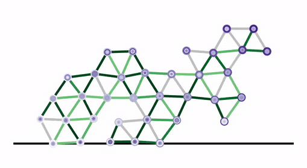
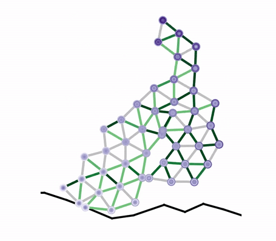
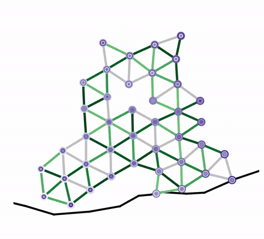
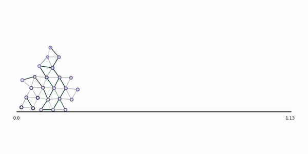
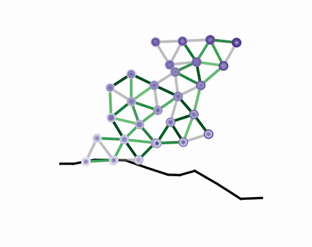

# ELDiR: Evolution and learning in differentiable robots

**Code up your favorite evolutionary algorithm and leverage the power of CUDA-accelerated differentiable simulation for fast policy learning and fitness evaluation in complex robots.**

<p align="center">
  
</p>

**This project was developed out of the paper [Evolution and learning in differentiable robots, Strgar et al](https://arxiv.org/abs/2405.14712). See the `2024-RSS-Strgar` [branch](https://github.com/lstrgar/ELDiR/tree/2024-RSS-Strgar) of this repository for code that reproduces experimental results from that paper.**

<p align="center">
  
</p>

### :star: Project Site & Video: [ELDiR](https://sites.google.com/view/eldir)

### :star: Paper: [Evolution and learning in differentiable robots, Strgar et al.](https://arxiv.org/abs/2405.14712)

### :star: Citation: If our work is useful to you please [cite our paper](https://github.com/lstrgar/ELDiR/blob/main/README.md#citation)

### :star: Appearing in: 
- #### *[Proceedings of Robotics: Science and Systems 2024](https://roboticsconference.org/)*
- #### *[Virtual Creatures Competition 2024](https://sites.google.com/view/vcc-2024)*
- #### *[Conference on Artificial Life (Late Breaking Abstract)](https://2024.alife.org/)*

<p align="center">
  
</p>

### :dragon: :dragon: This repository is under active development

## Table of contents

[Installation](https://github.com/lstrgar/ELDiR/blob/main/README.md#installation)

[Quick start](https://github.com/lstrgar/ELDiR/blob/main/README.md#quick-start)

[Visualize results](https://github.com/lstrgar/ELDiR/blob/main/README.md#visualize-results)

[Accelerating experiments with CUDA](https://github.com/lstrgar/ELDiR/blob/main/README.md#accelerating-experiments-with-cuda)

[Scaling experiments](https://github.com/lstrgar/ELDiR/blob/main/README.md#scaling-experiments)

[Adapting the evolutionary algorithm](https://github.com/lstrgar/ELDiR/blob/main/README.md#adapting-the-evolutionary-algorithm)

[Adapting the simulator & learning objective](https://github.com/lstrgar/ELDiR/blob/main/README.md#adapting-the-simulator--learning-objective)

##

### Installation
<pre lang="bash">
git clone git@github.com:lstrgar/ELDiR.git; cd ELDiR
conda create --name ELDiR python=3.10.13 --yes
conda activate ELDiR
pip install -r requirements.txt
</pre>

**Notes:** 
- If you intend to make substantial modifications we recommend [forking](https://docs.github.com/en/pull-requests/collaborating-with-pull-requests/working-with-forks/fork-a-repo) the respository.
- We find that an isolated `conda` environment is easy to work with; however, this is not required so long as you have a working `pip` installation.

### Quick start

A simple python invocation will initiate evolution and learning according to the algorithm described in our [paper](https://arxiv.org/abs/2405.14712):

<pre lang="bash">
python main.py
</pre>

### Visualize results

Visualization of robots is handled automatically with each generation. Automated visualization can be deactivated by running main.py with the flag `--no_viz`. After running the program with the defaults without automated visualization, you can visualize your results using the `visualize-defaults.ipynb` notebook. If you discover any exciting robots please share your results! Here is a little skipper we found :) 

<p align="center">
  
</p>

###  Accelerating experiments with CUDA

This framework can be used **with or without** a [CUDA-enabled](https://developer.nvidia.com/about-cuda) GPU:

<pre lang="python">
# main.py
use_cuda = False # True
</pre>

If your machine has more than one GPU you can parallelize across a subset of them by specifying the desired device indices: 

<pre lang="python">
# main.py
device_ids = [0, 3, ...]
</pre>

### Scaling experiments

Subject to your available computing resources you may want to increase or decrease the scale of your experiments. There are several straightforward ways of doing this:

:diamond_shape_with_a_dot_inside: **Robot population size**. Robots are simulated and trained in parallel. A smaller/larger population size means decreasing/increasing simulator space complexity and, possibly, time complexity.

:diamond_shape_with_a_dot_inside: **Number of generations**. Time complexity scales directly with the number of generations evolution runs for. 

<pre lang="python">
# main.py
pop_size = 10
n_gens = 50
</pre>

### Adapting the evolutionary algorithm

The codebase distinguishes three evolutionary algorithmic components: [genetic representation](https://github.com/lstrgar/ELDiR/blob/main/operators/geno_pheno.py), [mutation](https://github.com/lstrgar/ELDiR/blob/main/operators/mutate.py), and [selection](https://github.com/lstrgar/ELDiR/blob/main/operators/select.py). You can easily swap-in your own algorithm by implementing a small set of functions and overriding the defaults.

#### Default implementations
By default the framework follows the evolutionary method described in our [paper](https://arxiv.org/abs/2405.14712). Briefly, we employ a direct representation of genotypes in terms of a binary grid over which random mutation occurs by flipping bits in the mask. Our selection operator chooses the top 50% of robots based on their learned ability to locomote. The code implementing the defaults is found in the `operators/defaults` [folder](https://github.com/lstrgar/ELDiR/edit/main/operators/defaults).

#### The interface

Each of the three components and their corresponding interfaces are briefly described below. For more information see the `operators` [folder](https://github.com/lstrgar/ELDiR/edit/main/operators) where will find the `geno_pheno.py`, `mutate.py`, and `select.py` files, which specify detailed templates and instructions for for implementing the necessary functions. It may also be helpful to review our [distinction between the fitness function and the learning objective](.

:large_orange_diamond: **Genetic representation**

To create a custom genetic representation users must implement the following two functions:

<pre lang="python">
def random_geno(n: Int, outdir: Str) -> Str
</pre>

The function `random_geno` takes an integer `n` and string `outdir` as input, generates a random population of `n` genotypes, saves the population to a single file in `outdir`, and returns the file path. Note: our code is agnostic to the data structure and file format used to store the population and related metadata. See the `operators/geno_pheno.py` [file](https://github.com/lstrgar/ELDiR/edit/main/operators/geno_pheno.py) for more information. 

<pre lang="python">
def geno_2_pheno(pop_fpath: Str) -> None
</pre>

The function `geno_2_pheno` takes a string `pop_fpath` (from `random_geno`), loads the population, appends a phenotype representation of each robot, and saves the result back to `pop_fpath`. The phenotype representation must include the dictionary keys `points` and `springs`, which represent the vertices and edges of the robot's body. See the `operators/geno_pheno.py` [file](https://github.com/lstrgar/ELDiR/edit/main/operators/geno_pheno.py) for more information, **specifically that related to the structure of `points` and `springs` and suggestions for default values**. 

:large_orange_diamond: **Mutation**

To create a custom mutation operator users must implement the following function:

<pre lang="python">
def mutate(pop_fpath: Str, gen_idx: Int, fit: NDArray) -> Str
</pre>

The function `mutate` takes a string `pop_fpath`, the path of the population genotype file (from `random_geno`), an integer `gen_idx`, and `numpy` array `fit`. `gen_idx` corresponds to the generation number of the offspring that will be created by calling this function, which may be useful metadata. The array `fit` is of shape `n` rows by `learning_iters` columns and represents the positive performance trajectories of each robot in the population throughout learning. `mutate` applies a mutation to the population genotypes, writes the offspring population to a file, and returns the file path. See the `operators/mutate.py` [file](https://github.com/lstrgar/ELDiR/edit/main/operators/mutate.py) for more information. 

:large_orange_diamond: **Selection**

To create a custom selection operator users must implement the following function:

<pre lang="python">
def select(pop_fpath: Str, pop_fit: NDArray, offspring_fpath: Str, offspring_fit: NDArray, outdir: Str) -> tuple[Str, NDArray]
</pre>

The `select` function takes two strings (`pop_fpath`, `offspring_fpath`), two `numpy` arrays (`pop_fit`, `offspring_fit`), and a string `outdir` as inputs. The `_fpath` strings represent file paths to the current population and offspring population (from `mutate`). The arrays represent the positive performance trajectories of the two populations throughout learning. `outdir` is the directory to which `select` should write results. The `select` function combines the two populations into the next generation of robots, writes the next generation to a file (in `outdir`), and returns the file path. The function must also return a numpy array containing the performance trajectories of the new population in row order matching that of robots written to the next generation file. See the `operators/select.py` [file](https://github.com/lstrgar/ELDiR/edit/main/operators/select.py) for more information. 

The abbreviated version of `main.py` below illustrates how the three components work together: 

<pre lang="python">
# Implement your own version of the evolutionary algorithm in the operators folder
from <b>operators.defaults.geno_pheno</b> import <b>random_geno</b>, <b>geno_2_pheno</b>
from <b>operators.defaults.mutate</b> import <b>mutate</b>
from <b>operators.defaults.select</b> import <b>select</b>

# Randomly sample an initial population of robots
pop_fpath = <b>random_geno(pop_size, outdir)</b>
<b>geno_2_pheno(pop_fpath)</b>

# Evaluate the initial population
pop_fit = simulate_pop(pop_fpath)

# Main evolution loop
for gen in range(n_gen):

    # Create offspring
    offspring_fpath = <b>mutate(pop_fpath, pop_fit)</b>
    <b>geno_2_pheno(offspring_fpath)</b>

    # Evaluate the offspring
    offspring_fit = simulate_pop(offspring_fpath)

    # Select the next generation
    pop_fpath, pop_fit = <b>select(pop_fpath, offspring_fpath, pop_fit, offspring_fit)</b>
</pre>

### Adapting the simulator & learning objective

Robots learn inside a differentiable physics simulator built with the [Taichi programming language](https://docs.taichi-lang.org/) `v1.7.1`. The simulator is entirely contained inside `simulator/sim.py` and is invoked from a function calld `simulate_pop` in `simulator/utils.py`.

#### Why Taichi?

[Taichi](https://docs.taichi-lang.org/) is a highly performant domain specific language for GPU-accelerated numerical simulation and automatic differentiation. Moreover, it is embedded in Python enabling fast development, and Taichi outperforms Python packages like Numba, PyTorch, and JAX in simulation-based computing and compilation time. One particularly nice feature of Taichi is that it exposes fine-grained mathematical operators over individual elements. In contrast, packages like PyTorch and JAX depend largely on array-based operations. For more information see the [Taichi FAQ](https://docs.taichi-lang.org/docs/faq#miscellaneous), [Taichi benchmarks repository](https://github.com/taichi-dev/taichi_benchmark), and the original [DiffTaichi paper](https://arxiv.org/abs/1910.00935).

#### Robots in the simulator

In the simulator a robot consists of a set of points connected by edges, which together are modeled using a Hookean mass-spring system. Several examples of robots moving in the simulator can be seen in the GIFs at the top and bottom of this page. At every time step a neural controller modulates the rest lengths of springs throughout the robot’s body, which in turn exert forces on endpoint masses. After a predetermined number of time steps the simulator automatically differentiates an objective (loss) function $\mathcal{L}$ with respect to constituent parameters and a gradient-based update is applied to minimize $\mathcal{L}$.

#### Experimental scale in the simulator

In general, we do not recommend modifying the parameters or structure of the simulator without closely reviewing the [Taichi documentation](https://docs.taichi-lang.org/); however the simulator does contain two additional levers for easily [modifying experimental scale](https://github.com/lstrgar/ELDiR/blob/main/README.md#scaling-experiments):

:diamond_shape_with_a_dot_inside: **Time steps**. Robots are simulated serially through time, and state history must be tracked over each timestep. Fewer/more simulation timesteps results in lesser/greater simlator space and time complexity. Longer simulations can allow learning of more sophisticated behaviors; however, increasing the number of time steps may result in numerical instability in gradient computation. When in doubt, the default value is a good place to start. 

:diamond_shape_with_a_dot_inside: **Learning iterations**. Every learning iteration requires a full forward simulation and backwards pass to compute gradients. Evolutionary time complexity scales directly with the number of iterations. Empirically we have found that after a certain number of learning iterations behavioral improvement plateaus and there are diminishing returns to adding additional steps. Determining the optimal number of learning iterations will likely depend on the complexity of robots in your population, but the default value is a good starting point. 

```
# simulator/sim.py
sim_steps = 1000
learning_iters = 35
```

#### The learning objective

**For clarify of understanding and usage we emphasize that the simulator's differentiable objective (loss) function, $\mathcal{L}$, and the evolutionary (morphological) fitness function are not necessarily identical**. In fact, since the learning process minimizes the loss function, any measure of fitness would typically first involve negating loss. In the interface function `select` (defined above) we allow users to implicitly specify their own evolutionary fitness function in terms of the population’s positive performance trajectories throughout learning, i.e. $−\mathcal{L}$. 

By default the simulator's differentiable learning objective measures the horizontal displacement of a robot's center of mass from the beginning to the end of the simulation period. We found that maximizing displacement (by minimizing the negative displacement) results in robots that learn effective locomotion strategies; however, this function can be modified to prompt learning of a variety of alternate tasks (e.g. jumping or running). 

In order to modify the learning objective you will need to change the default function (shown below) and found [here](https://github.com/lstrgar/ELDiR/blob/main/simulator/sim.py#L173) in the code. 

<pre lang="python">
def compute_loss(t: ti.i32):
    for r, i in ti.ndrange(n_robots, max_objects):
        if i < n_objects[r]:
            loss[r] += x[r, t, i][0] - x[r, 0, i][0]
    for r in range(n_robots):
        loss[r] += (-1.0 / n_objects[r]) * loss[r] - loss[r]
</pre>

We recommend familiarity with [Taichi](https://docs.taichi-lang.org/) prior to making any substantive changes to the learning objective. To help new users get up to speed and possibly facilitate small modifications below we detail some of the key syntax and semantics of the default `compute loss`:

The important data structures include `x`, `loss`, and `n_objects` which correspond to robot position state tracking, the final computed loss values for each robot, and the number of points or masses contained in each robot. `x` is an array of shape `(n_robots, sim_steps, max_objects)`, `loss` and `n_objects` are both arrays of shape `(n_robots,)`. The function loops over all the robots being simulated and the corresponding point masses in their bodies using the `ti.ndrange` [syntax](https://docs.taichi-lang.org/docs/language_reference#the-ndrange-for-statement) and aggregates the displacement of each mass in the robot's corresponding loss slot. Then the loss value for each robot is normalized by the number of masses in the corresponding body and negated since the optimization procedure works through minimzation. Note the unusual usage of the `+=` operator, which results from the Taichi autodiff engine's global [data access rules](https://docs.taichi-lang.org/docs/differentiable_programming#global-data-access-rules).

#### Other modifications

If you are interested in making other modifications to the simulator such as those relating to the learning algorithm or neural network architecture we first suggest reviewing the Taichi docs. Relevant topics include: [type system](https://docs.taichi-lang.org/docs/type), [memory layout](https://docs.taichi-lang.org/docs/field), [kernels and functions](https://docs.taichi-lang.org/docs/kernel_function), and [automatic differentiation in Taichi](https://docs.taichi-lang.org/docs/differentiable_programming). 

## Future work

We are actively soliciting feedback to improve this repository. If you have specific requests or suggestions that would facilitate your use cases please open a GitHub issue.

## Citation

If our work is useful to you please cite our paper:

```
@inproceedings{
strgar2024evolutionandlearning,
title={Evolution and learning in differentiable robots},
author={Strgar, Luke and Matthews, David and Hummer, Tyler and Kriegman, Sam},
booktitle={Robotics: Science and Systems},
year={2024},
url={https://arxiv.org/abs/2405.14712}
}
```

##

<p align="center">
  
</p>
<p align="center">
  
</p>
<p align="center">
  
</p>
